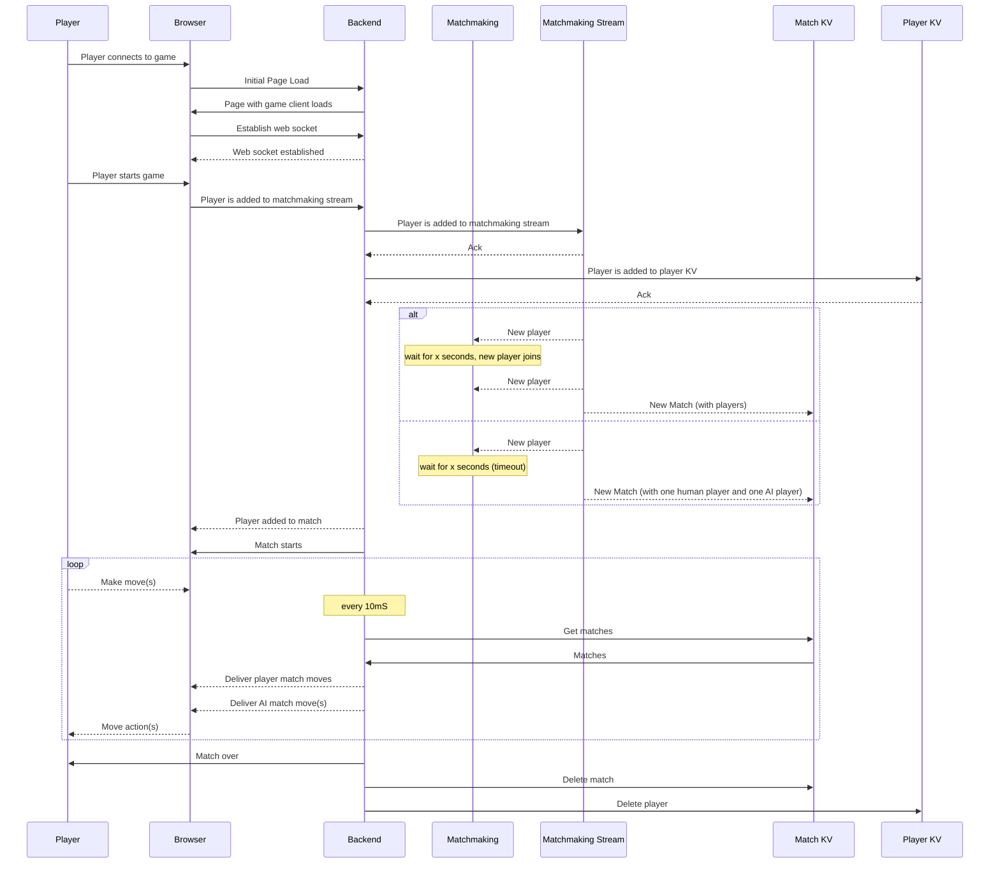

# Walkthrough

Cybervet is an in-browser one or two person game. The goal of the game depends on the player chosen (see below). The motivation for the game was showing off key features of NATS.io, including: pub-sub, key-value and streaming, which all run in the embedded game server. We load tested it to a few thousand players and everything held up well with low CPU and memory usage.

The game was created entirely in house by [Synadians](https://www.synadia.com/) with game industry experience.

## Diagram

Explanations are contained in the rest of this document.

## NATS

If you want to read no further, here are the key NATS aspects of the game:

- Players are added to a matchmaking stream when first starting a game
- Players are entries in a KV bucket with data from the game join queue
- Matches are entries in a KV bucket
- Telemetry is shipped to the collector through core NATS pub/sub

## Playing the Game

Two different game roles are playable:

- Patient
- Surgeon

The goal of the patient is to kill yourself! You achieve this by playing three mini games simultaneously; a sequential card game, a moving target guessing game represented as a breathing bottle, and a 'rock, paper, scissors' style game. The patient wins if the heart rate drops to 0 bpm. Winning here is anti-logical, making the surgeon the hero of the game.

The goal of the surgeon is save the creature! The surgeon challenges the patient with the same three mini games, by setting the order of the sequential game, moving the breathing target and by selecting rock, paper or scissors. The surgeon wins if the heart rate increases to 100 bpm.

# Basic Structure

Cybervet has the structure of a typical game with a front-end and back-end, with one difference: the front-end web client is delivered through the back-end via one exposed socket that delivers the whole experience over HTTP semantics.

NATS is embedded within the game server binary and latency is almost non-existent. The game server sets up its own NATS server, along with the streams and KV stores.

### Match Making

A stream (FIFO, discard old, TTL set to 30m) is created that contains new player registrations. This information is then picked up by a consumer in a loop that holds two player slots. If a player slot can't be fulfilled by real people queued up in the matchmaking stream, then players will be paired with a rules based "AI" player to play against.

You can test this out by opening two different browser screens in Incognito mode. Chances are, you will be playing against yourself. This is a great way to explore the game rules!

### Matches

Matches are stored in the KV store and are serviced through the tick based game loop.

### Players

Player data is stored in the KV store and is serviced through the tick based game loop.

### Game Loop

The game server, like all games, is based on a set of loops, governed by ticks. These ticks are spaced at 10mS and govern the matchmaking queue, the patients, and the surgeons. The game scales out within these loops extremely well as the actions themselves are over a much larger seconds time frame. It's unlikely that player actions are aligned exactly within any 10mS tick and so the game server can handle thousands of players simultaneously without any signs of stress.

This was actually tested prior to the game launch at SUSECon EU 23 with 4000, scripted and randomly timed simultaneous players. The CPU and memory gauges barely moved from their idle positions, seeing no more than a 5% increase in CPU activity.

### Deployment

Deployment is nice and simple and is a single binary. The whole game is compiled in Go with the game graphic assets and game client, all bin packed into the binary. No external HTTP server dependency exists as the inbound standard `net/http` server deals with the asset delivery and `websocket` handler for game updates.

### Game Client

This client asset is delivered via the web server and updates from the backend game server are delivered over an RPC over NATS to the front-end, via the webhook NATS end-point.

# Game Flows

### Match Making

# Summary

Cybervet is a great example of using NATS to run an entire game. From the front-end transport of event data over NATS websockets, to the back-end controlling matches, user and matchmaking data through stream and KV assets. Finally, there was an operational system for this game that exposed Prometheus metrics and the Prometheus server was in fact a microservice that subscribed to the metrics subjects and projected a scraping page.
