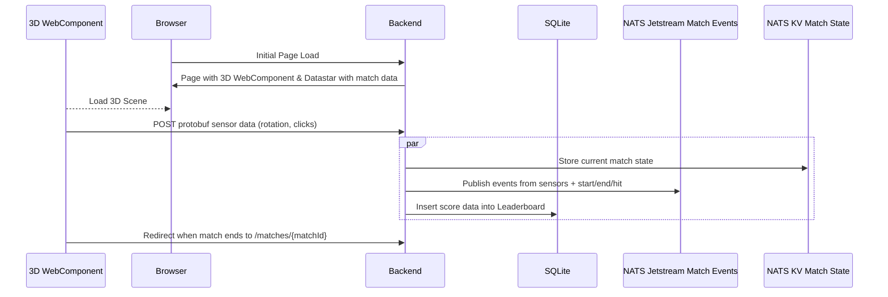
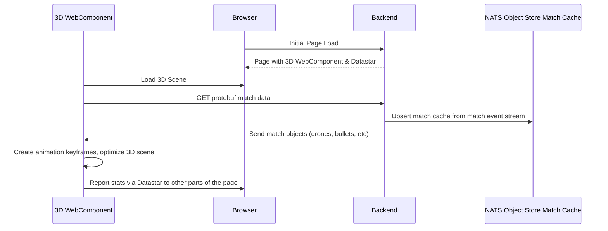
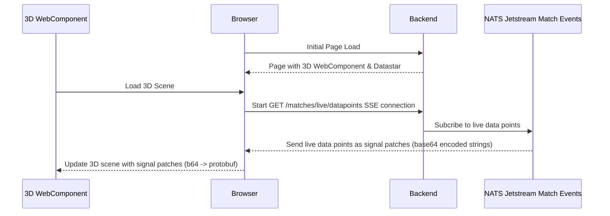
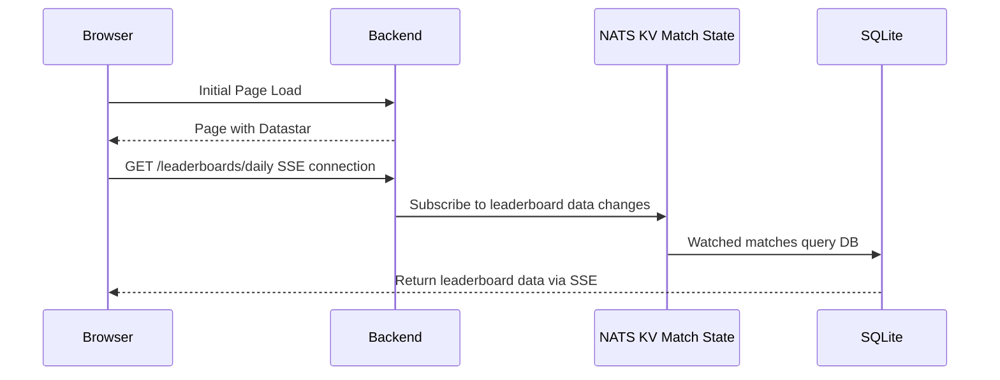

# Drone Game

## Overview

For KubeCon NA 23, wanted to build something that would push NATS to the limits and stun the audience. So we built an Augmented Reality drone game! The game is played in a web browser and uses a 3D scene to show the drones and bullets. As users play the game, millions of data points are collected and stored both in NATS and a database. We use every part of NATS (Jetstream, KV, Object Store) to build the game data. For things that aren't a good fit (user ranking queries) we use embedded SQLite.

To play the game, just grab your phone or tablet and headover to https://dronegame.io.

You will be asked for permissions to allow access to the sensors and once you've done that, tilt and pan your phone to scope the flying drones, then tap the screen to shoot. At the end of the round, your data will be viewable and you have the option of appearing on the leaderboard.

For the general release, we removed the camera requirement, so the drones appear in an arena. This makes people less suspicious we're doing anything questionable without retracting from the game itself.

## Sequence Flow

### Match begins

Route: `/matches/new`

### Match details

Route: `/matches/{matchId}`

#### Details

The match details page will show the match data and the 3D scene. The 3D can get large so there is an optimization step to reduce the number of animation keyframes.

### Match live

Route: `/matches/live`

#### Details

Multiple matches can be live at the same time. The backend will show the latest data points for a match unless it stops sending data for N seconds, then it will pick the next match message as the current one.

### Leaderboard

Route: `/leaderboards/daily`

