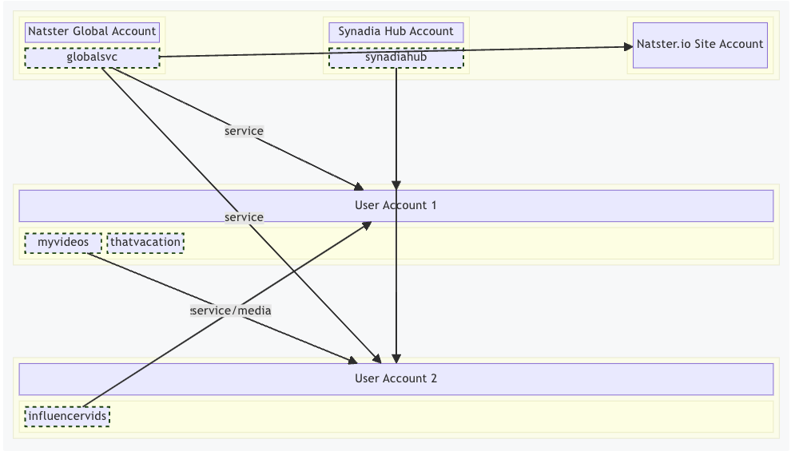
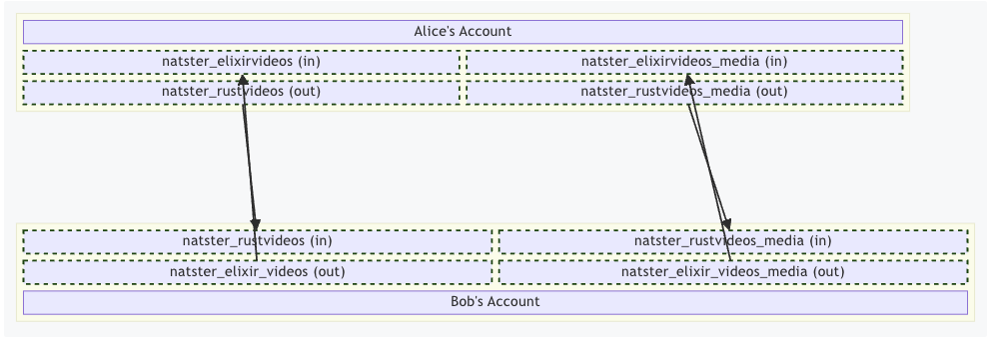

# Walkthrough

[Natster](https://natster.io) is a NATS.io-based media sharing platform. It is a reference application that illustrates patterns for building resilient, scalable, distributed applications that utilize nothing but NATS for all of their core needs.

It was originally created for KubeCon Europe 2024 and was used live during the event to highlight the power of NATS! (We admit it was temporarily confusing; people were mistaking Synadia for a file sharing company!)

Nevertheless, the team that created Natster went above and beyond with this reference application. Despite being for demo purposes, it is a fully functioning, secure and safe file sharing service.

Natster doesn’t require much at all from its users. You will need a Synadia Cloud account and a machine to run the CLI tools. You can sign up for a free account with no commitments. Synadia Cloud is a globally hosted, managed NATS cluster that gives distributed applications an unmatched foundation on which to build.

Go to https://cloud.synadia.com to register and create a new account and check the docs [here](https://docs.natster.io/usage/installation/) for the next steps.

## Architecture

Natster leans heavily into NATS and the powerful account isolation capabilities of the decentralised authentication model. Below you can see the sharing of the service and media between accounts. The architecture around NATS to enable this sharing to happen is minimal and consists of a web UI, an API service and a set of CLI tools. The team went even further and came up with a novel model for binding OAuth against one-time codes for secure usage with the CLI tooling.

There is already an extensive set of documentation for Natster and it won't be repeated for the sake of brevity. You can find that here:
https://docs.natster.io

